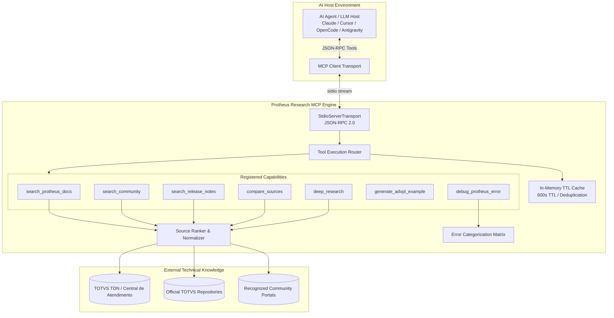
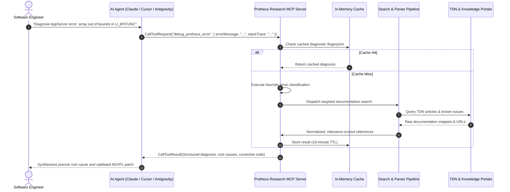

# Protheus Research MCP Server

<div align="center">

**Private Model Context Protocol (MCP) Server for TOTVS Protheus Enterprise Architecture & Diagnostics**

[](https://nodejs.org/)
[](https://www.typescriptlang.org/)
[](https://modelcontextprotocol.io/)
[](#system-scope)
[](#license)

<br />

**English** &nbsp;|&nbsp; [Português (Brasil)](README.pt-BR.md)

</div>

> A specialized Model Context Protocol (MCP) middleware engineered to equip AI coding agents with domain-specific intelligence, structured documentation retrieval, stack trace heuristic diagnostics, and canonical ADVPL/TL++ syntax standards across the TOTVS Protheus ecosystem.

---

## Table of Contents

- [Concept & Rationale](#concept--rationale)
- [System Architecture](#system-architecture)
- [Agent Tool-Call Lifecycle](#agent-tool-call-lifecycle)
- [Tool Suite Specification](#tool-suite-specification)
- [Security & Enterprise Isolation](#security--enterprise-isolation)
- [System Scope](#system-scope)
- [Legal Disclaimer](#legal-disclaimer)
- [License](#license)

---

## Concept & Rationale

Software engineering within the **TOTVS Protheus ERP** environment presents distinct domain challenges:
- Proprietary language syntaxes (**ADVPL**, **TL++**) that standard, general-purpose LLMs frequently misinterpret or hallucinate.
- Extensive, disparate documentation repositories across TDN (TOTVS Developer Network), technical issue bulletins, and release notes.
- Complex AppServer runtime execution behaviors, including memory management quirks, database cursors (`GetNextAlias`, `ChangeQuery`), and runtime stack traces (Access Violations, Array Bounds, lock contention).

The **Protheus Research MCP Server** operates as a structured semantic bridge. Conforming strictly to the **Model Context Protocol (MCP)** specification, it exposes clean, deterministic tools that AI agent platforms (such as Claude, Cursor, OpenCode, and Antigravity) invoke dynamically to ground their code suggestions and architectural diagnostics in authoritative technical facts.

---

## System Architecture

The server runs as a state-isolated daemon communicating via the standard JSON-RPC 2.0 protocol over standard input/output (`stdio`):



### Core Subsystems

1. **Protocol Core (`src/index.ts`):** Implements the official `@modelcontextprotocol/sdk` schemas (`ListToolsRequestSchema`, `CallToolRequestSchema`), handling tool discovery, parameter validation, and structured error responses.
2. **Deterministic Source Ranker (`src/services/searcher.ts`):** Prioritizes official TOTVS documentation domains (`tdn.totvs.com`, `centraldeatendimento.totvs.com`) as Level 1 authoritative sources, indexing recognized technical community portals as Level 2 advisory references.
3. **Error Heuristic Engine (`src/tools/debugError.ts`):** Pattern-matching matrix analyzing raw Protheus AppServer error logs, categorizing failure classes (Array Bounds, Access Violations, Deadlocks, REST/SOAP faults, Database timeouts), and returning structured remediation workflows.
4. **Code Synthesis Engine (`src/tools/generateExample.ts`):** Produces standard-compliant ADVPL, TL++, and Embedded SQL patterns adhering strictly to modern Protheus guidelines (`Local` variable scoping, logical deletion handling, and cross-RDBMS query wrappers).
5. **In-Memory Cache (`src/utils/cache.ts`):** Fast, key-value TTL store preventing outbound duplicate requests and upstream rate-limiting during recursive multi-step reasoning runs.

---

## Agent Tool-Call Lifecycle



---

## Tool Suite Specification

| Tool Identifier | Scope | Technical Function |
| :--- | :---: | :--- |
| **`search_protheus_docs`** | Official Docs | Queries TDN, Central de Atendimento, and official TOTVS frameworks with optional module and version scoping. |
| **`debug_protheus_error`** | Diagnostics | Heuristic pattern analysis classifying runtime crashes, stack traces, and AppServer dumps with remediation steps. |
| **`generate_advpl_example`** | Code Synthesis | Generates production-ready, canonical ADVPL, TL++, Embedded SQL, and FWRest boilerplate adhering to TOTVS modern guidelines. |
| **`deep_research`** | Correlation | Orchestrates autonomous multi-tier research cross-referencing documentation, release notes, and community solutions. |
| **`compare_sources`** | Comparison | Cross-verifies competing implementation approaches or legacy vs. modern framework methods. |
| **`search_community`** | Community Hubs | Queries curated developer portals and forums for field-tested workarounds and niche customizations. |
| **`search_release_notes`** | Lifecycle | Checks issue resolutions, cumulative update packages, and framework changes across Protheus releases. |

### Tool Schemas & Payloads

#### 1. `search_protheus_docs`
```json
// Input Schema
{
  "query": "FWRest",
  "module": "SIGAFAT",
  "version": "12.1.2210"
}

// Sample Output Payload
{
  "results": [
    {
      "title": "FWRest - Framework ADVPL - TDN",
      "url": "https://tdn.totvs.com/display/tec/FWRest",
      "snippet": "Classe para consumo de serviços RESTful em ADVPL, suportando métodos HTTP padronizados, SSL e manipulação de cabeçalhos.",
      "sourceType": "official_tdn",
      "sourceLevel": 1,
      "relevance": 95
    }
  ],
  "totalFound": 12
}
```

#### 2. `debug_protheus_error`
```json
// Input Schema
{
  "errorMessage": "array out of bounds [0] of [1] on U_MYFUNC(MYFUNC.PRW)",
  "stackTrace": "U_MYFUNC (MYFUNC.PRW) 15/08/2026 14:22:01",
  "environment": "Protheus 12.1.2210, SQL Server 2019"
}

// Sample Output Payload
{
  "diagnosis": "Category: Array Bounds. 6 authoritative references located.",
  "probableCauses": [
    "Attempting to read index <= 0 or beyond array length (Len(aArray)).",
    "Empty dataset returned by query/DbSeek without length validation prior to indexing."
  ],
  "verificationSteps": [
    "Inspect AppServer console log for full execution context.",
    "Verify RPO compilation status and dictionary synchronization."
  ],
  "fixes": [
    "Enforce defensive boundary checks using If Len(aData) >= nIndex before accessing aData[nIndex].",
    "Initialize dynamic collections safely using AAdd() or aClone()."
  ]
}
```

#### 3. `generate_advpl_example`
```json
// Input Schema
{
  "language": "advpl",
  "description": "Query customers from SA1 with logic deletion handling and JSON serialization",
  "context": "Faturamento (SIGAFAT)"
}

// Sample Output Payload
{
  "language": "advpl",
  "bestPractices": [
    "Enforce explicit Local variable declarations for predictable memory scope.",
    "Use GetNextAlias() to avoid cursor collisions in concurrent threads.",
    "Apply ChangeQuery() for cross-database portability.",
    "Always verify logical deletion flag (D_E_L_E_T_)."
  ]
}
```

---

## Security & Enterprise Isolation

- **Air-Gapped Operation:** The server operates strictly as an analytical knowledge middleware. It does not establish direct connections to customer production ERP databases, DBAccess ports, or live transactional tables.
- **Zero Sensitive Data Ingestion:** The engine does not store, transmit, or process client business records, ERP credentials, or proprietary business logic.
- **Controlled Outbound Communication:** Web requests are strictly confined to public documentation hosts (TDN, Central de Atendimento, GitHub) over standard TLS/HTTPS.

---

## System Scope

This repository documents the architectural blueprint, design patterns, and capability contracts of the **Protheus Research MCP Server**. As a private enterprise asset tailored to specialized development environments, public distribution packages, automated build artifacts, and client environment configurations are maintained outside public repositories.

---

## Legal Disclaimer

TOTVS, Protheus, ADVPL, and TL++ are registered trademarks of **TOTVS S.A.** This project is an independent developer productivity and architectural research middleware. It is neither affiliated with, sponsored by, nor endorsed by TOTVS S.A.

---

## License

All rights reserved. Proprietary software. Refer to [LICENSE](LICENSE) for terms.

---

<div align="center">
  <sub>Designed & engineered by <b>Eduardo de Lima Paranhos</b></sub>
</div>
