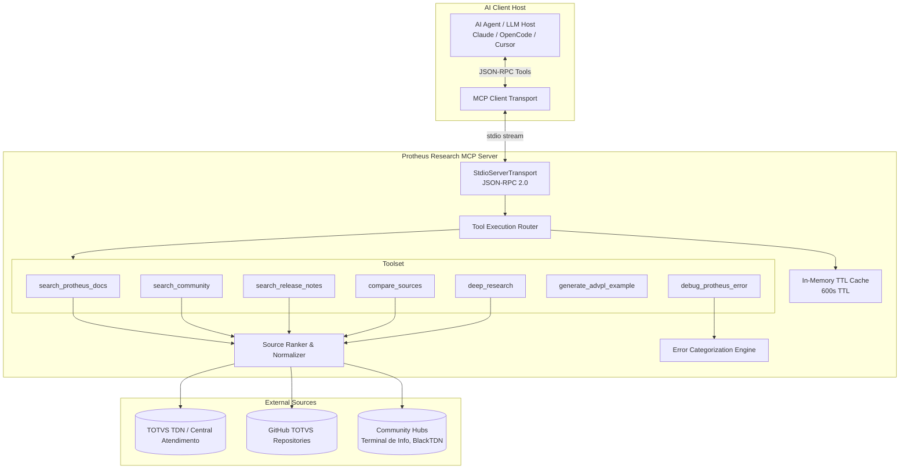
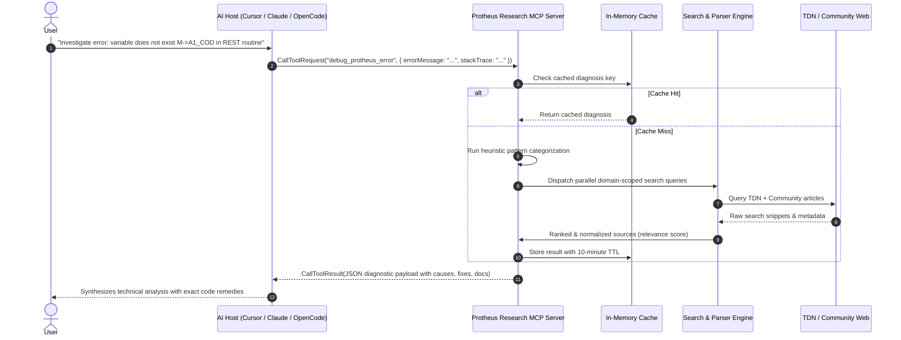

# Protheus Research MCP Server

[](https://nodejs.org/)
[](https://www.typescriptlang.org/)
[](https://modelcontextprotocol.io/)
[](https://opensource.org/licenses/MIT)

A high-performance **Model Context Protocol (MCP)** server tailored for the **TOTVS Protheus** enterprise ecosystem. It equips AI agents and developer workflows (Claude Desktop, OpenCode, Cursor, Antigravity) with structured real-time search, official documentation lookup across TDN, trusted community insights, runtime error heuristics, and modern ADVPL/TL++ code generation.

---

## Architecture Overview

The server implements the Model Context Protocol specification over standard I/O (`stdio`), acting as an intelligent bridge between LLM hosts and TOTVS technical documentation hubs.



### Key Subsystems

1. **Protocol Core (`src/index.ts`)**: Built on `@modelcontextprotocol/sdk`, exposing standard `ListToolsRequestSchema` and `CallToolRequestSchema` handlers.
2. **Deterministic Source Ranker (`src/services/searcher.ts`)**: Prioritizes authoritative TOTVS domains (`tdn.totvs.com`, `centraldeatendimento.totvs.com`) with Level 1 reliability, while indexing recognized community technical portals with Level 2 reliability.
3. **Error Heuristic Engine (`src/tools/debugError.ts`)**: Regex-driven pattern matcher mapping ADVPL stack traces (Access Violations, Array Bounds, Deadlocks, REST/SOAP faults, DBAccess timeouts) to remediation matrices.
4. **Code Synthesizer (`src/tools/generateExample.ts`)**: Emits strict, production-ready ADVPL, TL++, embedded SQL, and FWRest boilerplate adhering to TOTVS modern development guidelines.
5. **In-Memory Cache (`src/utils/cache.ts`)**: Fast key-value store preventing upstream rate limits and duplicate outbound roundtrips during multi-step agent reasoning loops.

---

## MCP Agent Tool-Call Lifecycle



---

## Detailed Tool Reference

### 1. `search_protheus_docs`
Searches authoritative TOTVS portals including TDN, Central de Atendimento, and official GitHub repositories.

#### Input Schema
```json
{
  "query": "FWRest",
  "module": "SIGAFAT",
  "version": "12.1.33"
}
```

#### Output Payload
```json
{
  "results": [
    {
      "title": "FWRest - Framework ADVPL - TDN",
      "url": "https://tdn.totvs.com/display/tec/FWRest",
      "snippet": "Classe para consumo de serviços RESTful em ADVPL, suportando métodos GET, POST, PUT, DELETE, gerenciamento de cabeçalhos e SSL.",
      "sourceType": "official_tdn",
      "sourceLevel": 1,
      "relevance": 95
    }
  ],
  "totalFound": 12
}
```

---

### 2. `debug_protheus_error`
Heuristic engine analyzing Protheus runtime crashes, stack traces, and AppServer errors.

#### Input Schema
```json
{
  "errorMessage": "array out of bounds [0] of [1] on U_MYFUNC(MYFUNC.PRW)",
  "stackTrace": "U_MYFUNC (MYFUNC.PRW) 15/08/2026 14:22:01\nU_RESTEXEC (RESTEXEC.PRW) 15/08/2026 14:20:10",
  "environment": "Protheus 12.1.2210, SQL Server 2019"
}
```

#### Output Payload
```json
{
  "diagnosis": "**Categoria**: Array Bounds\n\nErro classificado como: **Array Bounds**. Foram encontradas 6 fontes relevantes para investigação.",
  "probableCauses": [
    "- Tentativa de acesso a índice <= 0 ou superior ao comprimento do array (`Len(aVetor)`).",
    "- Retorno vazio em função de busca (`DbSeek` ou query) sem validação antes de acessar o array de resultados."
  ],
  "verificationSteps": [
    "1. Verificar logs do AppServer (appserver_*.log)",
    "2. Verificar logs do SmartClient na estação",
    "3. Verificar se o RPO está atualizado e compilado",
    "4. Verificar versão do Framework e LIBs",
    "5. Testar em ambiente de homologação"
  ],
  "fixes": [
    "- Proteger a leitura com `If Len(aDados) >= nPos` antes de indexar `aDados[nPos]`.",
    "- Inicializar vetores dinâmicos com `aClone()` ou `AAdd()` defensivo."
  ],
  "preventiveMeasures": [
    "- Implementar tratamento de erros com bloco BEGIN SEQUENCE / END SEQUENCE",
    "- Realizar testes em homologação antes de promover a produção"
  ],
  "officialSources": [
    {
      "title": "Tratamento de Exceções e Erros em ADVPL - TDN",
      "url": "https://tdn.totvs.com/display/tec/Tratamento+de+Erros",
      "sourceLevel": 1
    }
  ]
}
```

---

### 3. `generate_advpl_example`
Generates modern, standard-compliant ADVPL, TL++, SQL Server queries, or FWRest endpoint structures.

#### Input Schema
```json
{
  "language": "advpl",
  "description": "Read customers from table SA1 with query filtering and JSON serialization",
  "context": "Módulo Faturamento (SIGAFAT)"
}
```

#### Output Payload
```json
{
  "language": "advpl",
  "description": "Read customers from table SA1 with query filtering and JSON serialization",
  "code": "#Include \"Protheus.ch\"\n#Include \"TopConn.ch\"\n\n/*/\n  Funcao: U_ReadCust\n  Descricao: Consulta customizada de clientes (SA1)\n/*/\nUser Function ReadCust(cEstado)\n    Local cQuery    := \"\"\n    Local cAlias    := GetNextAlias()\n    Local oResponse := JsonObject():New()\n    Local aClientes := {}\n\n    Default cEstado := \"SP\"\n\n    cQuery := \"SELECT A1_COD, A1_NOME, A1_MUN FROM \" + RetSqlName(\"SA1\") + \" \"\n    cQuery += \"WHERE A1_FILIAL = '\" + xFilial(\"SA1\") + \"' \"\n    cQuery += \"  AND A1_EST = '\" + cEstado + \"' \"\n    cQuery += \"  AND D_E_L_E_T_ = ' ' \"\n    cQuery := ChangeQuery(cQuery)\n\n    TCQuery cQuery New Alias (cAlias)\n\n    While !(cAlias)->(Eof())\n        AAdd(aClientes, {\"codigo\": AllTrim((cAlias)->A1_COD), \"nome\": AllTrim((cAlias)->A1_NOME)})\n        (cAlias)->(DbSkip())\n    EndDo\n    (cAlias)->(DbCloseArea())\n\n    oResponse['total'] := Len(aClientes)\n    oResponse['data']  := aClientes\nReturn oResponse:ToJson()\n",
  "bestPractices": [
    "Uso obrigatório de LOCAL para tipagem e escopo seguro.",
    "Uso de GetNextAlias() para isolar cursores temporários.",
    "Filtragem por filial (xFilial) e verificação de deleção lógica (D_E_L_E_T_).",
    "Uso de ChangeQuery() para compatibilidade multiplataforma de banco de dados."
  ]
}
```

---

### 4. `deep_research`
Orchestrates autonomous multi-step research across official docs, community portals, release notes, and known issue registries.

#### Input Schema
```json
{
  "query": "Migração de FWRest para TLPP REST Services",
  "depth": "deep",
  "modules": ["FRAMEWORK", "TECNOLOGIA"],
  "versions": ["12.1.33", "12.1.2210"]
}
```

---

## Client Wiring Guide

Configure the MCP server in your local developer environments:

### 1. Claude Desktop
Add to `claude_desktop_config.json` (macOS: `~/Library/Application Support/Claude/claude_desktop_config.json`, Linux: `~/.config/Claude/claude_desktop_config.json`):

```json
{
  "mcpServers": {
    "protheus-research": {
      "command": "node",
      "args": ["/path/to/protheus-research/dist/index.js"]
    }
  }
}
```

Or run directly with npx / global install:
```json
{
  "mcpServers": {
    "protheus-research": {
      "command": "npx",
      "args": ["-y", "protheus-research"]
    }
  }
}
```

### 2. OpenCode
Add to your project's `opencode.jsonc` or global configuration:

```jsonc
{
  "mcp": {
    "servers": {
      "protheus-research": {
        "command": "node",
        "args": ["/path/to/protheus-research/dist/index.js"],
        "enabled": true
      }
    }
  }
}
```

### 3. Cursor
Add to `.cursor/mcp.json`:

```json
{
  "mcpServers": {
    "protheus-research": {
      "command": "node",
      "args": ["/path/to/protheus-research/dist/index.js"]
    }
  }
}
```

### 4. Antigravity / Gemini CLI
Add to `~/.gemini/config/mcp_config.json`:

```json
{
  "mcpServers": {
    "protheus-research": {
      "command": "node",
      "args": ["/path/to/protheus-research/dist/index.js"],
      "env": {}
    }
  }
}
```

---

## Execução Local (Opcional)

```bash
# Clone e build local do MCP
git clone https://github.com/limaduzz11/protheus-research.git
cd protheus-research
npm install
npm run build
```

---

## Legal & Educational Disclaimer

TOTVS, Protheus, ADVPL, and TL++ are registered trademarks of **TOTVS S.A.** This project is an independent developer productivity tool built for technical research and software engineering workflow enhancement. It is neither affiliated with, sponsored by, nor endorsed by TOTVS S.A. No confidential or proprietary client assets are contained within this software.

---

## License

This project is licensed under the [MIT License](LICENSE).
