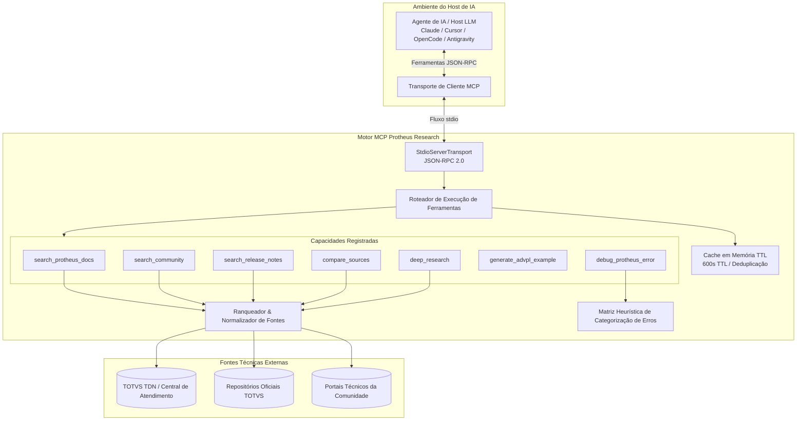
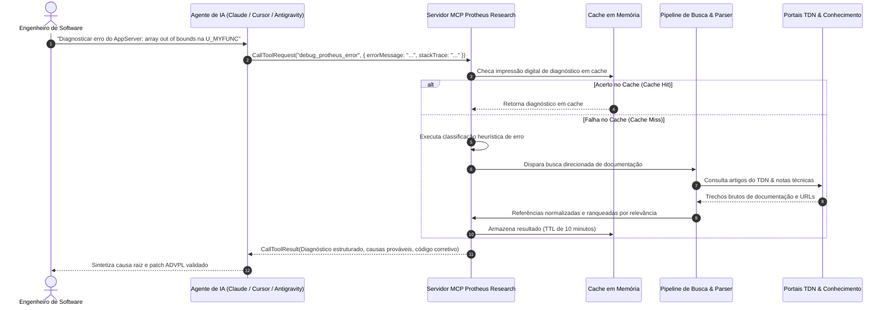

# Servidor MCP Protheus Research

<div align="center">

**Servidor Privado Model Context Protocol (MCP) para Arquitetura & Diagnóstico Técnico no TOTVS Protheus**

[](https://nodejs.org/)
[](https://www.typescriptlang.org/)
[](https://modelcontextprotocol.io/)
[](#escopo-do-sistema)
[](#licença)

<br />

[English](README.md) &nbsp;|&nbsp; **Português (Brasil)**

</div>

> Middleware especializado no padrão Model Context Protocol (MCP) projetado para equipar agentes de IA com inteligência técnica de domínio, busca estruturada em documentações, diagnósticos heurísticos de stack trace e padrões canônicos de sintaxe ADVPL/TL++ no ecossistema TOTVS Protheus.

---

## Sumário

- [Conceito & Motivação](#conceito--motivação)
- [Arquitetura do Sistema](#arquitetura-do-sistema)
- [Ciclo de Vida de Chamada de Ferramenta](#ciclo-de-vida-de-chamada-de-ferramenta)
- [Catálogo de Ferramentas (Tools)](#catálogo-de-ferramentas-tools)
- [Segurança & Isolamento Corporativo](#segurança--isolamento-corporativo)
- [Escopo do Sistema](#escopo-do-sistema)
- [Aviso Legal](#aviso-legal)
- [Licença](#licença)

---

## Conceito & Motivação

A engenharia de software no ecossistema **TOTVS Protheus ERP** apresenta particularidades de domínio complexas:
- Linguagens proprietárias (**ADVPL**, **TL++**) cujos padrões são comumente alucinados por LLMs genéricos sem contexto especializado.
- Acervo documental extenso e distribuído entre TDN (TOTVS Developer Network), boletins técnicos de atualização e notas de release.
- Comportamentos intrínsecos de execução no AppServer, incluindo particularidades de memória, cursores de banco de dados (`GetNextAlias`, `ChangeQuery`) e mensagens de erro de runtime (Access Violations, Array Bounds, concorrência de locks).

O **Servidor MCP Protheus Research** atua como uma ponte semântica estruturada. Implementando estritamente a especificação **Model Context Protocol (MCP)**, ele expõe ferramentas determinísticas para que agentes de IA (como Claude, Cursor, OpenCode e Antigravity) fundamentem suas análises e sugestões de código em dados técnicos oficiais e heurísticas consolidadas.

---

## Arquitetura do Sistema

O servidor opera como um daemon com isolamento de estado, comunicando-se via protocolo padrão JSON-RPC 2.0 através da entrada/saída padrão (`stdio`):



### Subsistemas Centrais

1. **Núcleo de Protocolo (`src/index.ts`):** Construído sobre o `@modelcontextprotocol/sdk`, gerenciando esquemas formais (`ListToolsRequestSchema`, `CallToolRequestSchema`), validação de parâmetros e respostas de erro estruturadas.
2. **Ranqueador Determinístico de Fontes (`src/services/searcher.ts`):** Prioriza domínios oficiais da TOTVS (`tdn.totvs.com`, `centraldeatendimento.totvs.com`) com confiabilidade Nível 1, indexando portais técnicos reconhecidos da comunidade como Nível 2.
3. **Motor Heurístico de Diagnóstico (`src/tools/debugError.ts`):** Matriz de casamento de padrões para logs de erro do AppServer, categorizando classes de falhas (Array Bounds, Access Violations, Deadlocks, falhas REST/SOAP, timeouts de DBAccess) e retornando planos de remediação.
4. **Sintetizador de Código (`src/tools/generateExample.ts`):** Produz padrões canônicos em ADVPL, TL++ e Embedded SQL com foco em boas práticas modernas (escopo estrito `Local`, tratamento de deleção lógica e funções portáveis de banco).
5. **Cache em Memória (`src/utils/cache.ts`):** Armazenamento em chave-valor com TTL de 10 minutos, mitigando requisições duplicadas e limites de taxa (rate limiting) durante raciocínios recursivos em múltiplas etapas.

---

## Ciclo de Vida de Chamada de Ferramenta



---

## Catálogo de Ferramentas (Tools)

| Identificador | Escopo | Função Técnica |
| :--- | :---: | :--- |
| **`search_protheus_docs`** | Documentação Oficial | Consulta TDN, Central de Atendimento e repositórios oficiais com filtro opcional por módulo e versão. |
| **`debug_protheus_error`** | Diagnóstico | Análise heurística de padrões para falhas de runtime, stack traces e dumps do AppServer com passos de correção. |
| **`generate_advpl_example`** | Síntese de Código | Gera código canônico pronto para produção em ADVPL, TL++, Embedded SQL e FWRest segundo os padrões atuais da TOTVS. |
| **`deep_research`** | Correlação Profunda | Orquestra pesquisa autônoma em múltiplas etapas, cruzando documentações, release notes e fóruns técnicos. |
| **`compare_sources`** | Comparação | Valida abordagens concorrentes de implementação ou compara funções legadas com seus substitutos modernos. |
| **`search_community`** | Comunidade Especializada | Consulta portais e fóruns consolidados da comunidade para contornos validados em produção e customizações raras. |
| **`search_release_notes`** | Ciclo de Vida | Verifica correções de issues, pacotes acumulados de atualização e mudanças de framework entre releases do Protheus. |

### Exemplos de Esquemas & Retornos

#### 1. `search_protheus_docs`
```json
// Esquema de Entrada
{
  "query": "FWRest",
  "module": "SIGAFAT",
  "version": "12.1.2210"
}

// Retorno Estruturado
{
  "results": [
    {
      "title": "FWRest - Framework ADVPL - TDN",
      "url": "https://tdn.totvs.com/display/tec/FWRest",
      "snippet": "Classe para consumo de serviços RESTful em ADVPL, suportando métodos HTTP padronizados, SSL e manipulação de cabeçalhos.",
      "sourceType": "official_tdn",
      "sourceLevel": 1,
      "relevance": 95
    }
  ],
  "totalFound": 12
}
```

#### 2. `debug_protheus_error`
```json
// Esquema de Entrada
{
  "errorMessage": "array out of bounds [0] of [1] on U_MYFUNC(MYFUNC.PRW)",
  "stackTrace": "U_MYFUNC (MYFUNC.PRW) 15/08/2026 14:22:01",
  "environment": "Protheus 12.1.2210, SQL Server 2019"
}

// Retorno Estruturado
{
  "diagnosis": "Categoria: Array Bounds. 6 referências oficiais localizadas.",
  "probableCauses": [
    "Tentativa de leitura em índice <= 0 ou superior ao comprimento do array (Len(aArray)).",
    "Retorno vazio em função de consulta (DbSeek/Query) sem checagem de tamanho antes da indexação."
  ],
  "verificationSteps": [
    "Inspecionar log do AppServer para contexto completo da chamada.",
    "Verificar sincronismo do RPO e dicionário de dados."
  ],
  "fixes": [
    "Aplicar validação defensiva If Len(aDados) >= nPos antes de acessar aDados[nPos].",
    "Inicializar estruturas dinâmicas com AAdd() ou aClone()."
  ]
}
```

#### 3. `generate_advpl_example`
```json
// Esquema de Entrada
{
  "language": "advpl",
  "description": "Consulta de clientes na SA1 com tratamento de deleção lógica e retorno em JSON",
  "context": "Faturamento (SIGAFAT)"
}

// Retorno Estruturado
{
  "language": "advpl",
  "bestPractices": [
    "Declaração explícita de variáveis com escopo Local.",
    "Utilização de GetNextAlias() para isolar cursores temporários em concorrência.",
    "Aplicação de ChangeQuery() para portabilidade entre diferentes SGBDs.",
    "Filtragem obrigatória por filial (xFilial) e verificação da flag de deleção (D_E_L_E_T_)."
  ]
}
```

---

## Segurança & Isolamento Corporativo

- **Operação Desacoplada (Air-Gapped):** O servidor atua estritamente como middleware semântico e analítico. Não estabelece conexão com bancos de dados de produção do ERP, portas do DBAccess ou tabelas transacionais de clientes.
- **Zero Ingestão de Dados Sensíveis:** O sistema não armazena, transmite ou processa cadastros, dados comerciais de clientes ou regras de negócio corporativas confidenciais.
- **Comunicação de Saída Controlada:** Requisições web são restritas a portais públicos de documentação técnica (TDN, Central de Atendimento, GitHub) sobre protocolo seguro TLS/HTTPS.

---

## Escopo do Sistema

Este repositório documenta a especificação técnica, os padrões arquiteturais e os contratos funcionais do **Servidor MCP Protheus Research**. Por se tratar de um componente de engenharia proprietário para ambientes especializados, pacotes públicos de distribuição, rotinas automatizadas de build e arquivos de fiação em clientes locais não são disponibilizados publicamente.

---

## Aviso Legal

TOTVS, Protheus, ADVPL e TL++ são marcas registradas da **TOTVS S.A.** Este projeto é um middleware independente de pesquisa arquitetural e produtividade de engenharia, não possuindo afiliação, patrocínio ou endosso por parte da TOTVS S.A.

---

## Licença

Todos os direitos reservados. Software proprietário. Consulte [LICENSE](LICENSE) para termos.

---

<div align="center">
  <sub>Projetado e mantido por <b>Eduardo de Lima Paranhos</b></sub>
</div>
